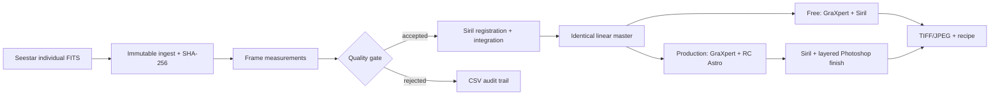

# SeestarFlow

SeestarFlow is a reproducible, non-generative workflow for turning individual
ZWO Seestar FITS subframes into auditable deep-sky masters. It preserves the raw
files, measures every frame, rejects weak data, stacks with Siril, and records
the commands used by both a free processing branch and the production branch.

The project was built around the Seestar S50 Pro, but the ingest and quality
stages work with conventional FITS light frames as well.

## What problem it solves

Smart-telescope apps make an attractive live stack. Serious reprocessing needs
something different: individual FITS frames, immutable originals, measurable
quality gates, repeatable integration, and a clear boundary between objective
linear processing and subjective finishing.



No AI image generation, painted nebulosity, or replacement sky is part of the
pipeline. Astronomy-specific machine-learning tools may be used for correction,
denoising, or star separation in the optional paid branch; their results must be
checked against the source data.

## The two processing stacks

| Stage | Free stack | Paid stack |
| --- | --- | --- |
| Raw archive and QA | SeestarFlow | SeestarFlow |
| Registration/integration | Siril | Siril |
| Gradient correction | GraXpert | GraXpert, or GradientXTerminator as an alternative |
| Color | Siril | Siril plus Photoshop adjustment layers |
| Optical correction | Siril deconvolution when justified | No deconvolution tool is assumed |
| Noise reduction | GraXpert | NoiseXTerminator once |
| Star separation | StarNet/Siril when suitable | StarXTerminator when suitable |
| Star control | Siril/manual masks | StarShrink only when stars overwhelm the subject |
| Stretch and finish | Siril | Siril plus a layered 16-bit Photoshop master |
| Catalog/release | File system | Lightroom, metadata, output pixels, print soft proof |

Both branches must start from the same linear master when comparing software.
The paid branch only wins when it improves credible detail, stellar profiles, or
noise texture without adding artifacts.

## Quick start on Windows

Requirements:

- Python 3.11+
- Siril 1.4+
- GraXpert for the free linear-processing branch
- Optional paid production tools: RC Astro, Photoshop, and Lightroom
- PixInsight only for future advanced workflows; it is not required here

```powershell
git clone https://github.com/Sleepyreaper/SeestarFlow.git
cd SeestarFlow
py -m venv .venv
.\.venv\Scripts\Activate.ps1
python -m pip install -e ".[dev]"
Copy-Item config.example.toml config.toml
python -m seestarflow doctor
```

Edit `config.toml` to match the installed executable locations. Then ingest a
night of individual FITS files:

```powershell
python -m seestarflow ingest `
  --source "E:\MyWorks\M31_sub" `
  --target M31 `
  --site backyard `
  --filter broadband `
  --mount eq

python -m seestarflow analyze --session ".\library\M31\<session>"
python -m seestarflow stack --session ".\library\M31\<session>"
python -m seestarflow linear --stack ".\library\M31\<session>\products\<run>\stack_linear.fit"
```

Optional RC Astro CLI preprocessing with the two licensed tools that support
linear FITS (`NoiseXTerminator` and `StarXTerminator`):

```powershell
python -m seestarflow premium `
  --linear ".\library\M31\<session>\products\<run>\linear\gradient_corrected.fits" `
  --kind galaxy `
  --star-separate
```

Use `--dry-run` on `stack`, `linear`, or `premium` to inspect generated commands
without launching external software.

Use `--grax-denoise` only for the free branch. The production branch runs
GraXpert background extraction without denoising, then uses NoiseXTerminator
once. It never stacks two learned denoisers merely because both are installed.

GradientXTerminator and StarShrink are Photoshop plug-ins. They are decision
gates in the finishing workflow, not CLI stages. BlurXTerminator is a separate
license and is intentionally not assumed by this repository.

Estimate raw FITS storage before a long plan:

```powershell
python -m seestarflow storage --exposure 10 --hours 8
```

The default frame size is an early measured S50 Pro telephoto sub. Replace it
with Monday's measured size using `--frame-bytes`.

Hash a final proof, portfolio, print, or archive export into the private release
ledger:

```powershell
python -m seestarflow release --file "D:/Astro/M27-portfolio-v01.jpg" --target M27 --variant portfolio
```

## Repository map

- `seestarflow/` — ingest, FITS parsing, quality measurement, orchestration
- `scripts/` — portable Siril scripts and Photoshop layered-master builder
- `docs/ARCHITECTURE.md` — data model and processing boundaries
- `docs/OPERATING_PLAYBOOK.md` — canonical end-to-end process and tool decisions
- `docs/APP_FIELD_CARD.md` — literal Seestar app settings and target/filter rules
- `docs/INSTALL_WINDOWS.md` — complete Windows setup
- `docs/CAPTURE.md` — how to acquire processable Seestar data
- `docs/FREE_VS_PAID.md` — fair comparison and tool roles
- `docs/BENCHMARKING.md` — test methodology and failure criteria
- `docs/DATASET_TEST_MATRIX.md` — which external datasets are valid proxies,
  what has been tested, and which missing test is worth acquiring next
- `docs/EQ_EXPOSURE_TEST.md` — timed EQ/Alt-Az and 10/30/60s experiments,
  with the `capture-compare` command for audited equal-integration selections
- `docs/PRODUCTION_WORKFLOW.md` — the 30-step public workflow and quality gates
- `docs/PROCESSING_RECIPES.md` — target-class settings for the installed stack
- `docs/FIRST_NIGHT_RUNBOOK.md` — historical commissioning runbook
- `docs/IP_AND_RELEASE.md` — provenance, privacy, metadata, and releases
- `docs/EQUIPMENT_AND_STORAGE.md` — what is required now and before travel
- `docs/workflow-sheet.example.json` — stage-sheet spec for public process graphics
- `tests/` — synthetic FITS and pipeline tests; no astronomy data required

Raw data, integrated masters, previews, and finished images are intentionally
excluded from Git.

## Important limitations

- Quality thresholds are starting points, not universal truth. Review rejected
  frames visually before deleting anything.
- The included Siril recipe is a light-frame workflow. Add matched calibration
  frames when the saved camera data require them.
- Star separation and ML correction are optional tools, not mandatory stages.
  Dense or undersampled fields can produce false halos or soft residuals.
- Never evaluate processing software using different integration times or
  independently tuned crops.

## License

MIT. Third-party applications and their models retain their own licenses. No
third-party datasets or generated image outputs are distributed here.
