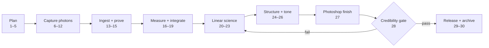

# SeestarFlow production workflow

This is the house process for an authentic astrophotograph: photons captured by
our telescope, preserved as original FITS files, objectively integrated, then
finished without painting, replacing, or generating astronomical structure.

The public story is the numbered workflow below. Exact per-image decisions,
masks, curve points, and local-opacity choices remain in the layered PSD and
private recipe. That split lets us explain the craft without giving away every
finishing decision.

## The 30-step sheet

| # | Phase | Action | Gate or retained evidence |
| ---: | --- | --- | --- |
| 1 | Plan | Select a target for the site, date, Moon, and open sky window | Target brief |
| 2 | Plan | Check cloud, wind, transparency, humidity, and dew-point spread | Go/no-go note |
| 3 | Plan | Choose Alt-Az for speed/outreach or EQ for efficiency and longer subs | Mount decision |
| 4 | Plan | Choose broadband or dual-band from the object's physics | Filter decision |
| 5 | Plan | Estimate storage, power, and accepted integration goal | Capacity plan |
| 6 | Capture | Stabilize the tripod and block direct stray light without blocking airflow | Setup photo |
| 7 | Capture | Connect, level or polar-align, initialize, and GOTO | Successful plate solve |
| 8 | Capture | Focus after temperature settles; refocus after a major temperature change | Focus note |
| 9 | Capture | Enable **Save Each Frame** and verify a target `_sub` folder appears | First raw FITS |
| 10 | Capture | Run a short framing and histogram test | Test preview |
| 11 | Capture | Capture uninterrupted lights; do not chase the live stretch | Raw FITS sequence |
| 12 | Capture | Record app/firmware, mode, filter, exposure, start/end, weather, and interruptions | Session note |
| 13 | Ingest | Copy by USB-C to the computer; never process directly on the telescope | Transfer folder |
| 14 | Ingest | Ingest immutable originals and compute SHA-256 hashes | `manifest.json` |
| 15 | Ingest | Make a second backup before deleting device data | Two verified copies |
| 16 | QA | Measure background, FWHM, ellipticity, star count, saturation, and score | `quality.csv` |
| 17 | QA | Review rejected and borderline frames visually | Approved/rejected list |
| 18 | Stack | Register approved subs and inspect registration yield | Registered sequence |
| 19 | Stack | Integrate with rejection and preserve a 32-bit linear master | `stack_linear.fit` |
| 20 | Linear | Crop unstable registration borders only | Cropped master |
| 21 | Linear | Remove gradients in GraXpert using subtraction; save and inspect the background model | Gradient QA |
| 22 | Linear | Correct optics conservatively with BlurXTerminator | 100% before/after crop |
| 23 | Linear | Denoise once with NoiseXTerminator; do not also run GraXpert denoise | Noise-texture QA |
| 24 | Structure | Optionally separate stars with StarXTerminator | Halo/residual gate |
| 25 | Tone | Stretch starless and star images independently in Siril | Unclipped black point |
| 26 | Color | Set neutral background, object color, saturation, and chrominance noise | Color-managed TIFFs |
| 27 | Finish | Recombine as layers in Photoshop; use masks and restrained local contrast | Layered 16-bit PSD |
| 28 | Proof | Compare against the linear master at 100%; reject invented texture, halos, and clipped cores | QA contact sheet |
| 29 | Release | Add creator/copyright metadata and Content Credentials; export web, print, and archive variants | Release manifest |
| 30 | Archive | Preserve originals, manifest, linear master, layered PSD, recipe, and final exports | Recoverable project |

For the image-by-image sheet like the M33 example, export a JPEG of each actual
keeper stage, copy `docs/workflow-sheet.example.json` into the private project,
point it at those stage files, and run:

```powershell
python -m pip install -e ".[media]"
python -m seestarflow workflow-sheet --spec "D:/Astro/TARGET/workflow-sheet.json"
```

The renderer builds a consistent branded PNG from one to thirty real
intermediates. The repository contains the renderer and example labels; private
projects contain the images and proprietary slider/mask decisions.

## Process architecture



## Three deliverables from every keeper

1. **Science master:** the uncropped or minimally cropped 32-bit linear FITS,
   never sharpened or stretched.
2. **Production master:** a layered 16-bit PSD with named stages and no
   flattened overwrite.
3. **Release family:** full-resolution print TIFF, color-managed web JPEG, and a
   watermarked proof generated from the same approved master.

The watermark belongs only on public proofs. It is not a substitute for raw
provenance, metadata, registration, or backups.

## Stop rules

- Stop capture for precipitation, condensation on electronics, unsafe wind,
  an unstable platform, or a blocked public route.
- Reject a processing stage if it produces repeating texture, dark rings,
  clipped galaxy or nebula cores, magenta/green background blotches, or stars
  that look punched out.
- Never delete rejected FITS during the first review. A threshold can be wrong;
  an erased original cannot be recovered.
- Never publish a proprietary or third-party practice dataset as our capture.

## Authoritative device behavior used by this workflow

- [ZWO's S50 Pro specification](https://us.seestar.com/products/seestar-s50-pro-smart-telescope)
  lists 128 GB eMMC (about 100 GB usable), individual JPEG/FITS support, Plan
  Mode, dual cameras, EQ support, and 60-second exposures only in EQ mode.
- [ZWO's Save Each Frame instructions](https://us.seestar.com/blogs/tutorial/simulated-stargazing)
  describe the per-target `_sub` folder that contains source frames.
- [ZWO's file-transfer guide](https://us.seestar.com/blogs/tutorial/seestar-file-storage-download-guide)
  supports app batch download and direct USB-C computer copying.
- [ZWO's EQ guide](https://us.seestar.com/blogs/tutorial/enable-equatorial-mount-mode-seestar)
  specifies a north-facing leg, the adapter/plate, and alignment within 1°.
